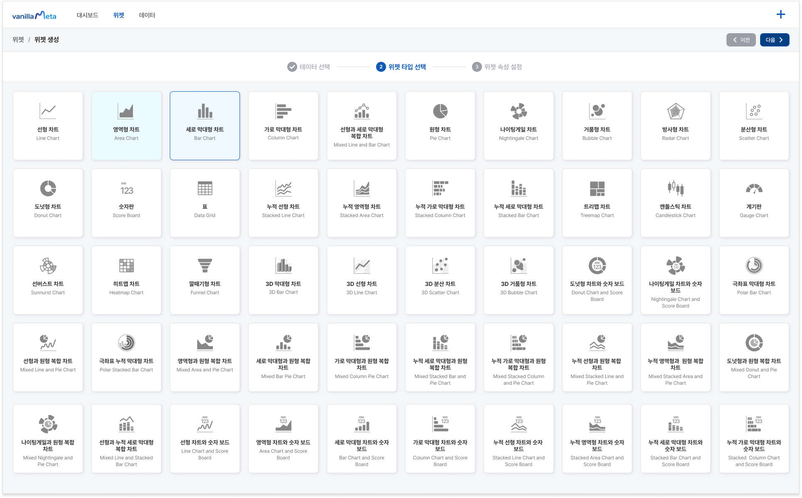
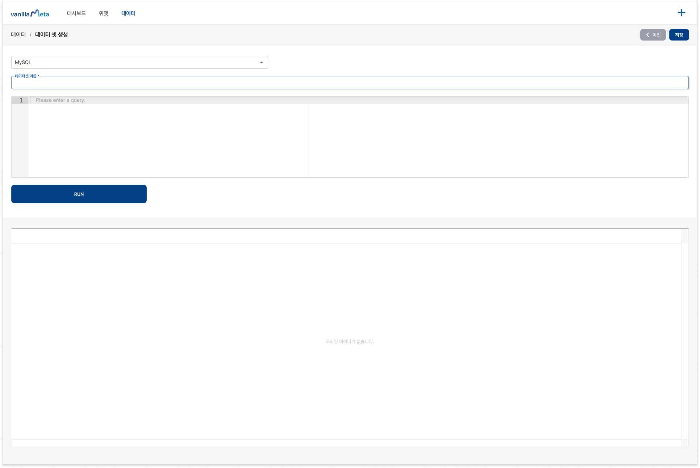
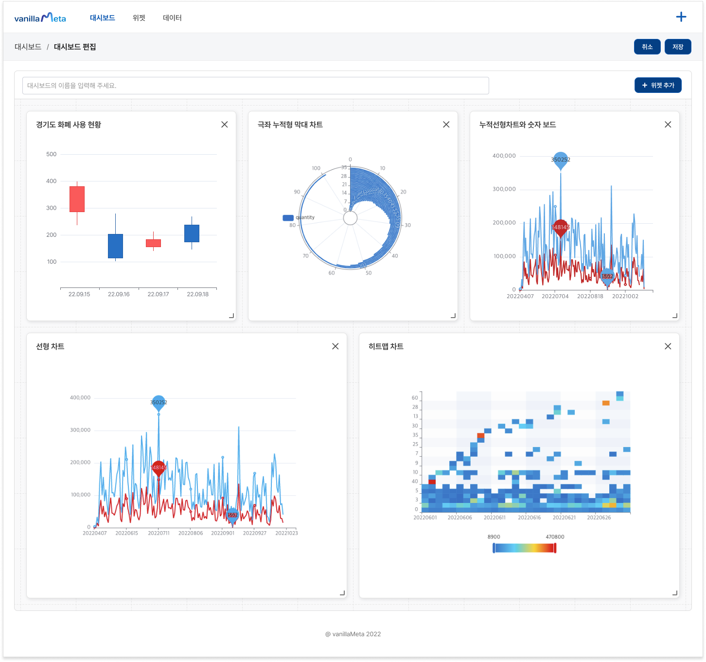

# VanillaMeta

 

최신 엔터프라이즈용 비즈니스 인텔리전스 웹 애플리케이션입니다.

# 바닐라메타를 사용해야 하는 이유

바닐라메타는 최신 데이터 탐색적 분석 및 데이터 시각화 솔루션입니다. 비즈니스 인텔리전스 도구를 대체하거나 보강할 수 있으며, 다양한 데이터 소스와 잘 통합 됩니다.

## 바닐라메타의 기능

- 코딩없이 차트 위젯 제작
- 50개 이상의 차트 타입 지원
- 사용자 맞춤형 대시보드 편집 및 공유
- 대시보드 템플릿 디자인 추천
- 고급 SQL 쿼리 편집기 및 데이터 미리보기
- 다양한 SQL 데이터베이스에 대한 즉시 지원

## 스크린샷

- **다양한 시각화 차트**
<kbd></kbd> 

- **강력한 SQL 편집기**
<kbd></kbd> 

- **코딩없이 차트 제작**
<kbd></kbd> 

- **템플릿 추천**
<kbd></kbd> 

## 지원하는 데이터베이스

- PostgresSQL
- MariaDB
- MySQL
- SQLServer
- SQLite
- Oracle
- DB2
- Amazon Redshift
- Big Query
