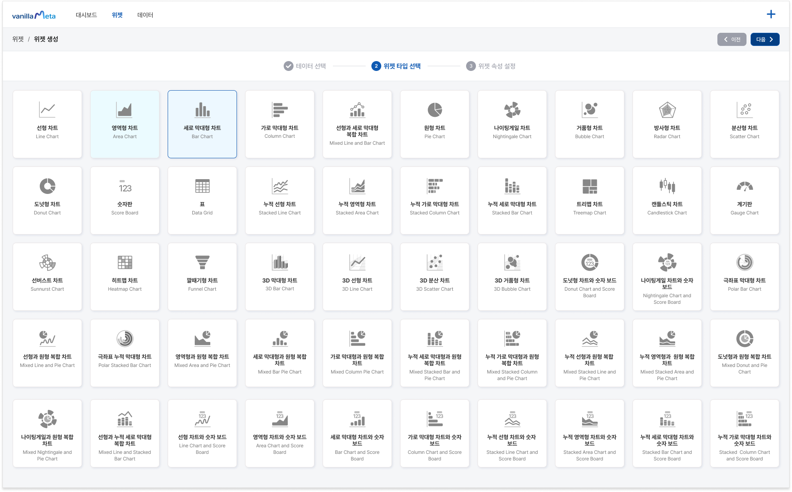
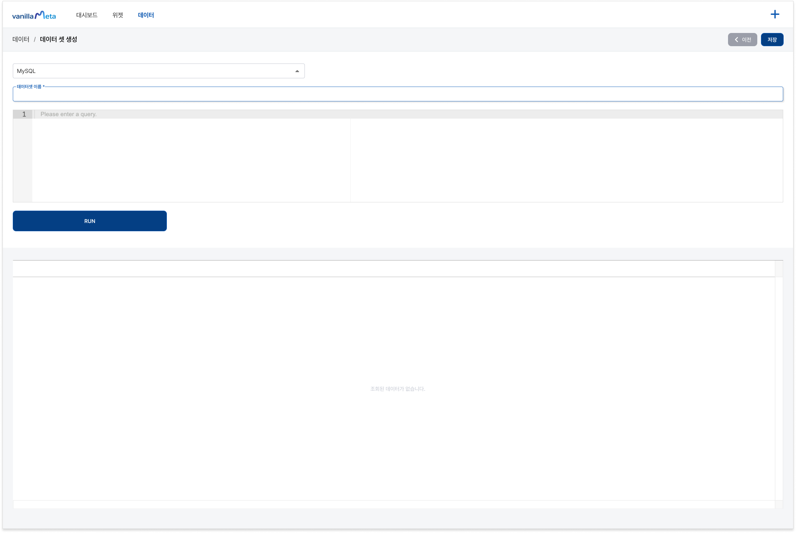
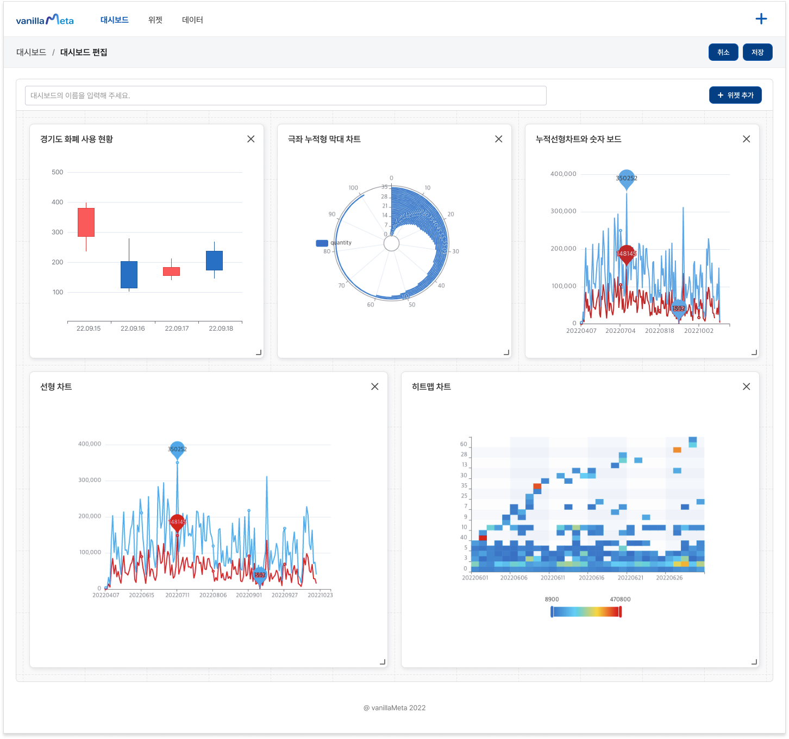
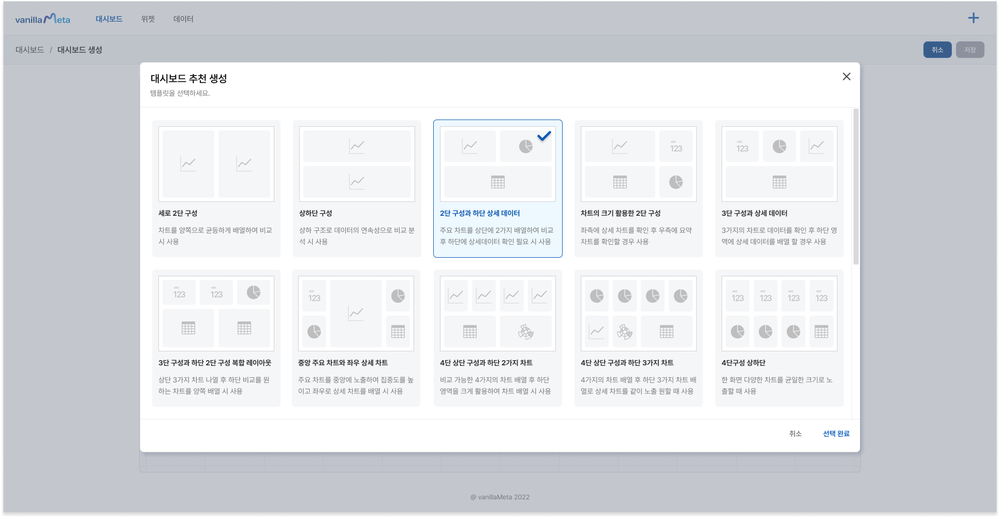

# VanillaMeta

<br/>

**최신 엔터프라이즈용 비즈니스 인텔리전스(BI) 웹 애플리케이션**

VanillaMeta는 NestJS 백엔드와 React 프론트엔드로 구성된 풀스택 BI 솔루션으로, 다양한 SQL 데이터베이스를 지원하여 강력한 데이터 시각화와 대시보드 기능을 제공합니다.

[](https://github.com/vanillabrain/vanillameta/actions)
[](LICENSE)

## 🚀 주요 기능

- **🎨 코딩 없는 차트 제작**: 직관적인 UI로 차트 위젯 생성
- **📊 50+ 차트 타입 지원**: ECharts 기반 다양한 시각화 옵션
- **📱 반응형 대시보드**: 드래그 앤 드롭으로 레이아웃 편집
- **🔗 다중 데이터베이스 지원**: 10개 이상의 SQL 데이터베이스 연결
- **⚡ 고성능 SQL 편집기**: 실시간 쿼리 실행 및 데이터 미리보기
- **🎯 템플릿 시스템**: 사전 정의된 대시보드 템플릿 제공
- **🔒 보안 인증**: JWT 기반 사용자 인증 및 권한 관리
- **📤 공유 기능**: URL 기반 대시보드 공유

## 🛠️ 기술 스택

### 백엔드 (backend-api/)
- **Framework**: NestJS 9.x
- **ORM**: TypeORM 0.3.x + Knex.js
- **인증**: Passport JWT
- **배포**: AWS Lambda (Serverless Framework)
- **모니터링**: 프로메테우스 메트릭 지원

### 프론트엔드 (frontend-web/)
- **Framework**: React 18.x + TypeScript
- **UI Library**: Material-UI 5.x
- **차트 라이브러리**: Apache ECharts
- **상태 관리**: React Context API
- **레이아웃**: React Grid Layout
- **배포**: S3 + CloudFront

## 주요기능 화면

- **다양한 시각화 차트**
<kbd></kbd><br/>

- **강력한 SQL 편집기**
<kbd></kbd><br/>

- **코딩없이 차트 제작**
<kbd></kbd><br/>

- **템플릿 추천**
<kbd></kbd><br/>

## 지원하는 데이터베이스

- PostgreSQL
- MariaDB
- MySQL
- SQLServer
- SQLite
- Oracle
- Amazon Redshift
- Big Query
- Cockroachdb
- Snowflake

## 설치하기

### 🚀 Docker Compose 사용 (권장)

가장 빠르고 간편한 방법입니다:

```bash
# 프로젝트 루트에서 실행
docker compose up -d

# 테스트 스크립트 실행
./docker-test.sh
```

**접속 정보:**
- 프론트엔드: http://localhost:80
- 백엔드 API: http://localhost:3000/api/v1

### 🛠️ 로컬 개발 환경

개발자를 위한 설정:

#### 사전 요구사항
- Node.js 16+ 
- Redis Server (캐싱 및 세션 관리용)

#### Redis 설치 및 실행
```bash
# macOS (Homebrew)
brew install redis
redis-server --daemonize yes

# Ubuntu/Debian
sudo apt-get install redis-server
sudo systemctl start redis

# 연결 확인
redis-cli ping  # PONG 응답 시 정상
```

#### 프로젝트 설치
```bash
cd ~/vanillameta/backend-api/ npm install
cd ~/vanillameta/frontend-web/ npm install
```

## 시작하기

### Docker Compose 사용

```bash
# 전체 스택 실행
docker compose up -d

# 로그 확인
docker compose logs -f

# 서비스 중지
docker compose down
```

### 로컬 개발 환경

```bash
# 1. Redis 서버 시작 (별도 터미널)
redis-server --daemonize yes

# 2. 백엔드 API 시작
cd 현재위치/vanillameta/backend-api/ 
npm run seed:run  # 초기 데이터 생성
npm run start:local  # 로컬 환경으로 시작

# 3. 프론트엔드 시작 (새로운 터미널)
cd 현재위치/vanillameta/frontend-web/ 
npm run start:local
```
실행 후 localhost:3000경로에서

화면이 뜬다면 성공 !

```
현재 default 계정정보는
ID: guest
PW: Admin!@12
```
입니다. 이후 회원정보 변경하기 페이지에서 비밀번호를 바꿔서 사용하시면 됩니다

## db연동하기

사용하고 계신 MySql의 연결을 확인한 후 저장해 주세요.


## 데이터셋 설정하기
위젯에 적용할 데이터를 query문을 사용하여 선택하시고 저장해 주세요.


## 위젯 생성하기

1. 생성한 데이터 셋을 선택하고 다음으로 넘어가 주세요.


2. 원하는 타입의 위젯을 선택하고 다음으로 넘어가 주세요.


3. 원하는 위젯의 속성을 선택하시고 저장을 눌러주세요.


생성한 위젯들로 대시보드를 구성해 보세요!


