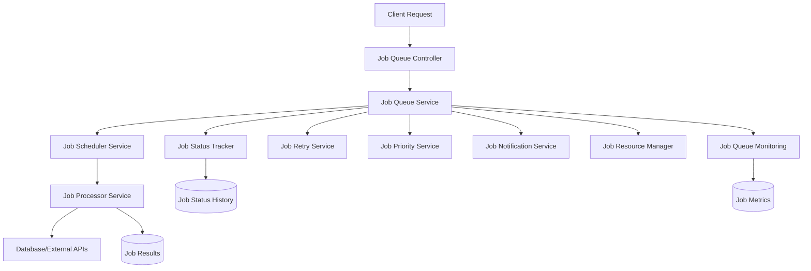

# VanillaMeta Background Job Queue System 가이드

## 📋 목차

1. [시스템 개요](#시스템-개요)
2. [아키텍처](#아키텍처)
3. [주요 구성 요소](#주요-구성-요소)
4. [사용법](#사용법)
5. [작업 유형](#작업-유형)
6. [모니터링 및 관리](#모니터링-및-관리)
7. [성능 최적화](#성능-최적화)
8. [문제 해결](#문제-해결)
9. [모범 사례](#모범-사례)
10. [API 참조](#api-참조)

## 🎯 시스템 개요

VanillaMeta Background Job Queue System은 대용량 데이터 처리, 복잡한 쿼리 실행, 대시보드 생성 등의 시간이 오래 걸리는 작업을 비동기적으로 처리하기 위한 시스템입니다.

### 주요 특징

- **비동기 처리**: 웹 요청과 분리된 백그라운드 작업 처리
- **우선순위 기반 스케줄링**: 작업 중요도에 따른 처리 순서 조정
- **자동 재시도**: 실패한 작업의 지능적 재시도 메커니즘
- **리소스 관리**: Lambda 환경에 최적화된 리소스 할당
- **실시간 모니터링**: 작업 상태 및 시스템 성능 추적
- **다중 알림 채널**: 이메일, Slack, 웹훅을 통한 알림

## 🏗️ 아키텍처



### 핵심 원칙

1. **분리된 관심사**: 각 서비스는 고유한 책임을 가짐
2. **확장성**: 수평적/수직적 확장 가능
3. **내결함성**: 부분적 실패에도 시스템 지속 동작
4. **관찰 가능성**: 모든 작업과 시스템 상태 추적

## 🧩 주요 구성 요소

### 1. JobQueueService
```typescript
// 작업 생성
const job = await jobQueueService.createJob({
  jobType: JobType.QUERY_EXECUTION,
  jobData: { query: 'SELECT * FROM users', databaseId: 1 },
  priority: JobPriority.NORMAL,
  maxRetries: 3
}, userId);
```

**주요 기능**:
- 작업 생성, 조회, 업데이트, 취소
- 작업 상태 관리
- 다음 처리할 작업 선택

### 2. JobSchedulerService
```typescript
// 우선순위 기반 스케줄링
await jobSchedulerService.scheduleJob(job);

// 예약된 작업 활성화
await jobSchedulerService.activateScheduledJobs();
```

**주요 기능**:
- 우선순위 기반 작업 스케줄링
- 메모리 내 우선순위 큐 관리
- 좀비 작업 정리
- 동시 실행 작업 수 제한

### 3. JobProcessorService
```typescript
// 작업 처리
await jobProcessorService.processJob(job);
```

**지원 작업 유형**:
- `QUERY_EXECUTION`: SQL 쿼리 실행
- `BULK_DATA_EXPORT`: 대용량 데이터 내보내기
- `DASHBOARD_GENERATION`: 대시보드 생성
- `DATA_MIGRATION`: 데이터 마이그레이션
- `CACHE_WARMUP`: 캐시 워밍업
- `REPORT_GENERATION`: 리포트 생성

### 4. JobStatusTrackerService
```typescript
// 상태 변경 기록
await statusTracker.recordStatusChange(
  jobId, 
  JobStatus.PENDING, 
  JobStatus.RUNNING,
  'worker-123',
  'Job started processing'
);

// 상태 히스토리 조회
const history = await statusTracker.getJobStatusHistory(jobId);
```

### 5. JobRetryService
```typescript
// 실패한 작업 재시도 예약
await retryService.scheduleRetry(failedJob);

// 수동 재시도
await retryService.retryJob(jobId);

// 벌크 재시도
const result = await retryService.bulkRetry(['job1', 'job2', 'job3']);
```

**재시도 전략**:
- **지수 백오프**: 재시도 간격이 점진적으로 증가
- **작업 유형별 전략**: 각 작업 유형에 맞는 재시도 정책
- **최대 재시도 제한**: 무한 재시도 방지
- **지터**: 동시 재시도로 인한 시스템 부하 분산

### 6. JobPriorityService
```typescript
// 우선순위 계산
const priority = priorityService.calculateJobPriority(job);

// 우선순위 업데이트
await priorityService.updateJobPriority(jobId, JobPriority.HIGH);

// 전체 우선순위 재계산
await priorityService.recalculateAllPriorities();
```

**우선순위 계산 요소**:
- 기본 우선순위 (LOW, NORMAL, HIGH, URGENT)
- 작업 연령 (오래된 작업일수록 높은 우선순위)
- 재시도 횟수 (재시도 작업에 높은 우선순위)
- 사용자 등급 (프리미엄 사용자 우대)
- 작업 복잡도

### 7. JobNotificationService
```typescript
// 작업 완료 알림
await notificationService.sendJobCompletionNotification(job, result);

// Slack 알림
await notificationService.sendSlackNotification(
  webhookUrl, 
  'Job completed successfully'
);

// 웹훅 알림
await notificationService.sendWebhookNotification(
  'https://api.example.com/webhook',
  { jobId: job.id, status: 'completed' }
);
```

**알림 채널**:
- **이메일**: 작업 완료/실패 알림
- **Slack**: 팀 채널 알림
- **웹훅**: 외부 시스템 통합
- **인앱 알림**: 실시간 브라우저 알림

### 8. JobResourceManagerService
```typescript
// 리소스 할당
const allocation = await resourceManager.allocateResources(job);

// 리소스 사용률 조회
const usage = resourceManager.getResourceUsage();

// 최적화 제안
const recommendations = resourceManager.getOptimizationRecommendations();
```

**관리 리소스**:
- **CPU**: 처리 능력 할당
- **메모리**: 메모리 사용량 제한
- **데이터베이스 연결**: DB 연결 풀 관리
- **네트워크 대역폭**: 네트워크 리소스 할당

### 9. JobQueueMonitoringService
```typescript
// 큐 상태 조회
const health = await monitoring.getQueueHealth();

// 성능 메트릭
const metrics = await monitoring.getPerformanceMetrics(24);

// 실시간 메트릭
const realtime = await monitoring.getRealtimeMetrics();
```

## 📘 사용법

### 기본 작업 생성

```typescript
import { JobQueueService, JobType, JobPriority } from './job-queue';

// 1. 간단한 쿼리 실행 작업
const queryJob = await jobQueueService.createJob({
  jobType: JobType.QUERY_EXECUTION,
  jobData: {
    query: 'SELECT COUNT(*) FROM users WHERE created_at > ?',
    params: ['2024-01-01'],
    databaseId: 1
  },
  priority: JobPriority.NORMAL,
  maxRetries: 3,
  estimatedTimeMs: 30000
}, userId);

// 2. 대용량 데이터 내보내기
const exportJob = await jobQueueService.createJob({
  jobType: JobType.BULK_DATA_EXPORT,
  jobData: {
    query: 'SELECT * FROM orders WHERE date >= ?',
    params: ['2024-01-01'],
    format: 'csv',
    chunkSize: 10000,
    databaseId: 1
  },
  priority: JobPriority.HIGH,
  requiresNotification: true,
  notificationEmail: 'user@example.com'
}, userId);

// 3. 예약된 작업
const scheduledJob = await jobQueueService.createJob({
  jobType: JobType.REPORT_GENERATION,
  jobData: {
    reportType: 'monthly_sales',
    month: '2024-01'
  },
  scheduledAt: '2024-01-31T23:59:59Z',
  priority: JobPriority.LOW
}, userId);
```

### 작업 상태 추적

```typescript
// 작업 상태 조회
const job = await jobQueueService.getJob(jobId, userId);
console.log(`Status: ${job.status}, Progress: ${job.progress}%`);

// 작업 목록 조회
const jobs = await jobQueueService.getJobs({
  status: JobStatus.RUNNING,
  jobType: JobType.QUERY_EXECUTION,
  page: 1,
  limit: 20
}, userId);

// 상태 히스토리 조회
const history = await statusTracker.getJobStatusHistory(jobId);
```

### 작업 관리

```typescript
// 작업 취소
await jobQueueService.cancelJob(jobId, 'User requested cancellation', userId);

// 작업 재시도
await jobQueueService.retryJob(jobId, userId);

// 우선순위 변경
await priorityService.updateJobPriority(jobId, JobPriority.URGENT, 'Urgent request');
```

## 🔧 작업 유형

### QUERY_EXECUTION
일반적인 SQL 쿼리 실행

```typescript
{
  jobType: JobType.QUERY_EXECUTION,
  jobData: {
    query: 'SELECT * FROM users WHERE status = ?',
    params: ['active'],
    databaseId: 1,
    timeout: 30000
  }
}
```

### BULK_DATA_EXPORT
대용량 데이터 내보내기

```typescript
{
  jobType: JobType.BULK_DATA_EXPORT,
  jobData: {
    query: 'SELECT * FROM transactions WHERE date >= ?',
    params: ['2024-01-01'],
    format: 'csv', // csv, json, xlsx
    chunkSize: 10000,
    compression: 'gzip',
    databaseId: 1
  }
}
```

### DASHBOARD_GENERATION
대시보드 생성

```typescript
{
  jobType: JobType.DASHBOARD_GENERATION,
  jobData: {
    dashboardId: 'dashboard-123',
    widgetQueries: [
      { widgetId: 'widget-1', query: 'SELECT COUNT(*) FROM users' },
      { widgetId: 'widget-2', query: 'SELECT AVG(revenue) FROM orders' }
    ],
    databaseId: 1
  }
}
```

### DATA_MIGRATION
데이터 마이그레이션

```typescript
{
  jobType: JobType.DATA_MIGRATION,
  jobData: {
    sourceConfig: { /* source DB config */ },
    targetConfig: { /* target DB config */ },
    tables: ['users', 'orders'],
    batchSize: 1000,
    validateData: true
  }
}
```

## 📊 모니터링 및 관리

### 모니터링 대시보드

```http
GET /v1/jobs/monitoring/dashboard
```

**응답 예시**:
```json
{
  "status": "SUCCESS",
  "data": {
    "queueHealth": {
      "status": "healthy",
      "totalJobs": 150,
      "pendingJobs": 12,
      "runningJobs": 3,
      "completedJobs": 130,
      "failedJobs": 5,
      "successRate": 96.3,
      "healthScore": 85
    },
    "performanceMetrics": {
      "averageExecutionTime": 15000,
      "throughputPerHour": 25,
      "peakThroughput": 40
    },
    "resourceUsage": {
      "cpuUtilization": 45.5,
      "memoryUsage": 2048,
      "activeConnections": 8
    }
  }
}
```

### 상태별 작업 조회

```http
GET /v1/jobs?status=RUNNING&limit=10
```

### 장시간 실행 작업 조회

```http
GET /v1/jobs/monitoring/long-running?thresholdMinutes=30
```

### 재시도 통계

```http
GET /v1/jobs/monitoring/retry-stats?days=7
```

## ⚡ 성능 최적화

### 1. 작업 우선순위 최적화

```typescript
// 중요한 작업에 높은 우선순위 부여
const urgentJob = await jobQueueService.createJob({
  jobType: JobType.QUERY_EXECUTION,
  jobData: { query: 'SELECT * FROM critical_data' },
  priority: JobPriority.URGENT, // 최고 우선순위
  maxRetries: 5
}, userId);

// 배치 작업에 낮은 우선순위 부여
const batchJob = await jobQueueService.createJob({
  jobType: JobType.BULK_DATA_EXPORT,
  jobData: { query: 'SELECT * FROM historical_data' },
  priority: JobPriority.LOW, // 낮은 우선순위
  scheduledAt: '2024-01-01T02:00:00Z' // 새벽 시간 실행
}, userId);
```

### 2. 리소스 할당 최적화

```typescript
// 리소스 사용률 모니터링
const usage = resourceManager.getResourceUsage();
if (usage.utilizationRates.cpu > 90) {
  console.log('CPU 사용률이 높습니다. 새 작업 추가를 지연합니다.');
}

// 최적화 제안 확인
const recommendations = resourceManager.getOptimizationRecommendations();
recommendations.recommendations.forEach(rec => {
  console.log(`권장사항: ${rec}`);
});
```

### 3. 배치 크기 조정

```typescript
// 데이터베이스별 최적 배치 크기 사용
const batchSizes = {
  mysql: 5000,
  postgresql: 10000,
  bigquery: 50000,
  snowflake: 100000
};

const exportJob = await jobQueueService.createJob({
  jobType: JobType.BULK_DATA_EXPORT,
  jobData: {
    query: 'SELECT * FROM large_table',
    chunkSize: batchSizes[databaseType] || 10000,
    databaseId: 1
  }
}, userId);
```

### 4. 캐시 활용

```typescript
// 자주 실행되는 쿼리는 캐시 활용
const cachedQueryJob = await jobQueueService.createJob({
  jobType: JobType.QUERY_EXECUTION,
  jobData: {
    query: 'SELECT COUNT(*) FROM users',
    useCache: true,
    cacheTTL: 3600, // 1시간 캐시
    databaseId: 1
  }
}, userId);
```

## 🔍 문제 해결

### 일반적인 문제들

#### 1. 작업이 오랫동안 대기 상태

**원인**:
- 리소스 부족
- 높은 우선순위 작업이 큐를 점유
- 시스템 과부하

**해결 방법**:
```typescript
// 1. 큐 상태 확인
const health = await monitoring.getQueueHealth();
console.log(`Pending jobs: ${health.pendingJobs}`);
console.log(`Running jobs: ${health.runningJobs}`);

// 2. 리소스 사용률 확인
const usage = resourceManager.getResourceUsage();
console.log('Resource utilization:', usage.utilizationRates);

// 3. 우선순위 재계산
await priorityService.recalculateAllPriorities();
```

#### 2. 작업 실패가 빈번함

**원인**:
- 데이터베이스 연결 문제
- 쿼리 타임아웃
- 메모리 부족

**해결 방법**:
```typescript
// 1. 실패 분석
const failureAnalysis = await statusTracker.getFailureAnalysis(7);
failureAnalysis.forEach(failure => {
  console.log(`Failure reason: ${failure.reason}, Count: ${failure.count}`);
});

// 2. 재시도 통계 확인
const retryStats = await retryService.getRetryStatistics(7);
console.log('Retry statistics:', retryStats);

// 3. 타임아웃 설정 조정
const timeoutJob = await jobQueueService.createJob({
  jobType: JobType.QUERY_EXECUTION,
  jobData: {
    query: 'SELECT * FROM large_table',
    timeout: 120000, // 2분으로 증가
    databaseId: 1
  }
}, userId);
```

#### 3. 메모리 사용량 과다

**해결 방법**:
```typescript
// 1. 청크 크기 감소
const optimizedJob = await jobQueueService.createJob({
  jobType: JobType.BULK_DATA_EXPORT,
  jobData: {
    query: 'SELECT * FROM huge_table',
    chunkSize: 1000, // 크기 감소
    databaseId: 1
  }
}, userId);

// 2. 메모리 모니터링
const systemMetrics = monitoring.getSystemMemoryMetrics();
if (systemMetrics.percentage > 80) {
  console.log('메모리 사용률이 높습니다. 새 작업을 지연합니다.');
}
```

### 로그 및 디버깅

```typescript
// 1. 작업별 상세 로그 조회
const job = await jobQueueService.getJob(jobId, userId);
console.log('Job details:', {
  id: job.id,
  status: job.status,
  progress: job.progress,
  errorMessage: job.errorMessage,
  executionTime: job.executionTimeMs,
  retryCount: job.retryCount
});

// 2. 상태 변경 히스토리
const statusHistory = await statusTracker.getJobStatusHistory(jobId);
statusHistory.forEach(history => {
  console.log(`${history.timestamp}: ${history.previousStatus} -> ${history.newStatus}`);
  if (history.reason) console.log(`Reason: ${history.reason}`);
});

// 3. 시스템 메트릭
const realtimeMetrics = await monitoring.getRealtimeMetrics();
console.log('Current system status:', realtimeMetrics);
```

## ✅ 모범 사례

### 1. 작업 설계

```typescript
// ✅ 좋은 예: 적절한 추정 시간과 재시도 설정
const goodJob = await jobQueueService.createJob({
  jobType: JobType.QUERY_EXECUTION,
  jobData: {
    query: 'SELECT * FROM users WHERE created_at > ?',
    params: [new Date('2024-01-01')],
    databaseId: 1
  },
  priority: JobPriority.NORMAL,
  maxRetries: 3,
  estimatedTimeMs: 30000, // 현실적인 추정 시간
  requiresNotification: true,
  notificationEmail: 'admin@example.com'
}, userId);

// ❌ 나쁜 예: 설정이 부족함
const badJob = await jobQueueService.createJob({
  jobType: JobType.QUERY_EXECUTION,
  jobData: { query: 'SELECT * FROM users' } // 파라미터 누락, 설정 부족
}, userId);
```

### 2. 에러 처리

```typescript
// ✅ 좋은 예: 포괄적인 에러 처리
try {
  const job = await jobQueueService.createJob(jobData, userId);
  
  // 작업 상태 주기적 확인
  const checkInterval = setInterval(async () => {
    const currentJob = await jobQueueService.getJob(job.id, userId);
    
    if (currentJob.status === JobStatus.COMPLETED) {
      console.log('작업 완료!');
      clearInterval(checkInterval);
    } else if (currentJob.status === JobStatus.FAILED) {
      console.error('작업 실패:', currentJob.errorMessage);
      clearInterval(checkInterval);
      
      // 필요시 재시도
      if (currentJob.canRetry) {
        await jobQueueService.retryJob(job.id, userId);
      }
    }
  }, 5000);
  
} catch (error) {
  console.error('작업 생성 실패:', error.message);
  // 적절한 에러 처리 로직
}
```

### 3. 성능 모니터링

```typescript
// ✅ 정기적인 시스템 상태 점검
async function performHealthCheck() {
  const health = await monitoring.getQueueHealth();
  
  if (health.healthScore < 70) {
    // 관리자에게 알림
    await notificationService.sendSystemNotification(
      'Queue Health Alert',
      `Health score is low: ${health.healthScore}`,
      'high'
    );
  }
  
  if (health.pendingJobs > 100) {
    console.log('대기 중인 작업이 많습니다. 리소스 증설을 고려하세요.');
  }
  
  if (health.successRate < 90) {
    console.log('성공률이 낮습니다. 시스템 점검이 필요합니다.');
  }
}

// 5분마다 헬스 체크 실행
setInterval(performHealthCheck, 5 * 60 * 1000);
```

### 4. 리소스 관리

```typescript
// ✅ 적응적 리소스 할당
async function createJobWithResourceCheck(jobData: any, userId: string) {
  // 1. 현재 리소스 사용률 확인
  const usage = resourceManager.getResourceUsage();
  
  // 2. 높은 사용률일 때 대기 또는 우선순위 조정
  if (usage.utilizationRates.cpu > 80) {
    jobData.priority = JobPriority.LOW;
    jobData.scheduledAt = new Date(Date.now() + 10 * 60 * 1000); // 10분 후 실행
  }
  
  // 3. 작업 생성
  return await jobQueueService.createJob(jobData, userId);
}
```

## 📚 API 참조

### Job Queue Controller

#### POST /v1/jobs
새 작업 생성

**요청 본문**:
```json
{
  "jobType": "QUERY_EXECUTION",
  "jobData": {
    "query": "SELECT * FROM users",
    "databaseId": 1
  },
  "priority": "NORMAL",
  "maxRetries": 3,
  "scheduledAt": "2024-01-01T12:00:00Z",
  "requiresNotification": true,
  "notificationEmail": "user@example.com"
}
```

#### GET /v1/jobs
작업 목록 조회

**쿼리 파라미터**:
- `status`: 작업 상태 필터
- `jobType`: 작업 유형 필터
- `priority`: 우선순위 필터
- `page`: 페이지 번호 (기본값: 1)
- `limit`: 페이지 크기 (기본값: 20)

#### GET /v1/jobs/{jobId}
특정 작업 조회

#### PUT /v1/jobs/{jobId}/status
작업 상태 업데이트

#### PUT /v1/jobs/{jobId}/cancel
작업 취소

#### POST /v1/jobs/{jobId}/retry
작업 재시도

#### POST /v1/jobs/bulk/retry
벌크 재시도

### 모니터링 API

#### GET /v1/jobs/monitoring/dashboard
종합 모니터링 대시보드

#### GET /v1/jobs/monitoring/health
큐 건강도 조회

#### GET /v1/jobs/monitoring/performance
성능 메트릭 조회

#### GET /v1/jobs/monitoring/long-running
장시간 실행 작업 조회

#### GET /v1/jobs/monitoring/retry-stats
재시도 통계

#### GET /v1/jobs/monitoring/priority-stats
우선순위 통계

#### GET /v1/jobs/monitoring/resources
리소스 사용률

#### GET /v1/jobs/monitoring/optimization
최적화 제안

### 관리 API

#### POST /v1/jobs/admin/recalculate-priorities
우선순위 재계산

## 📄 관련 문서

- [데이터베이스 연결 가이드](./database-connection-guide.md)
- [Redis 캐싱 구현 가이드](./redis-caching-guide.md)
- [배치 처리 구현 가이드](./batch-processing-guide.md)
- [API 문서](./api-documentation.md)

## 🆘 지원

문제가 발생하거나 질문이 있으시면:

1. 이 가이드의 [문제 해결](#문제-해결) 섹션을 확인하세요
2. 시스템 로그를 점검하세요
3. 모니터링 대시보드에서 시스템 상태를 확인하세요
4. 개발팀에 문의하세요

---

*이 문서는 VanillaMeta Background Job Queue System v1.0을 기준으로 작성되었습니다.*