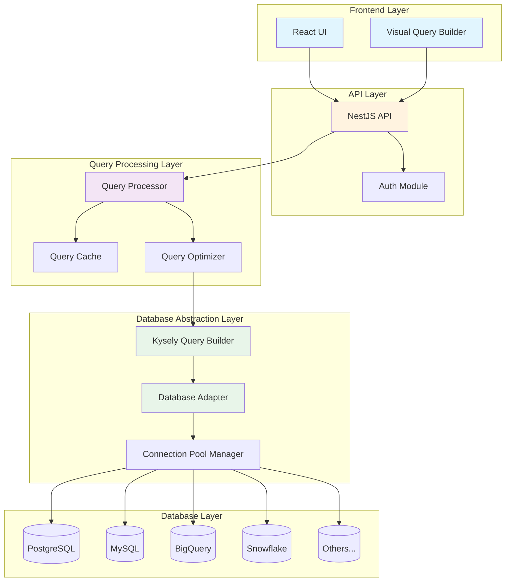
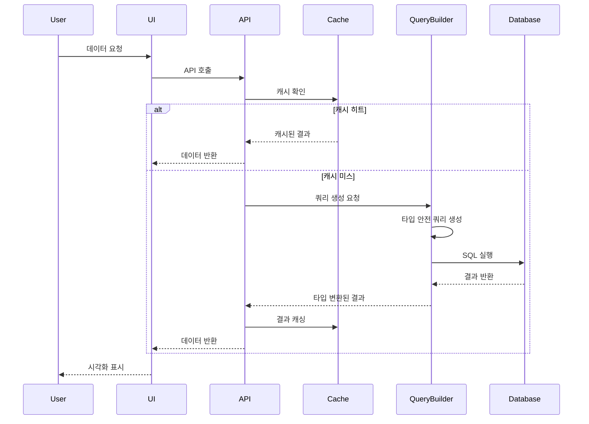

# VanillaMeta SQL 아키텍처 개선 계획

## 목차
1. [개요](#개요)
2. [현재 상태 분석](#현재-상태-분석)
3. [개선 목표](#개선-목표)
4. [TOBE 아키텍처](#tobe-아키텍처)
5. [데이터 흐름도](#데이터-흐름도)
6. [요구사항 정의 (PRD)](#요구사항-정의-prd)
7. [단계별 실행 전략](#단계별-실행-전략)
8. [기술 스택 비교](#기술-스택-비교)
9. [위험 요소 및 대응 방안](#위험-요소-및-대응-방안)

## 개요

VanillaMeta는 엔터프라이즈급 비즈니스 인텔리전스(BI) 플랫폼으로, 다양한 SQL 데이터베이스를 지원하는 데이터 시각화 솔루션입니다. 현재 Knex.js를 기반으로 한 SQL 처리 아키텍처의 한계점을 극복하고, 더 나은 성능과 타입 안정성을 제공하기 위한 개선 계획입니다.

### 프로젝트 배경
- **현재 기술 스택**: Knex.js (2.3.0) + TypeORM (0.3.9)
- **지원 데이터베이스**: PostgreSQL, MySQL, MariaDB, SQLServer, SQLite, Oracle, BigQuery, Redshift, Snowflake, CockroachDB
- **주요 사용 사례**: 
  - 사용자가 SQL 에디터 UI에서 직접 SQL 쿼리 작성 및 실행
  - 작성된 쿼리를 데이터셋으로 저장하고 재사용
  - 다양한 데이터베이스에서 raw SQL 실행
- **Knex.js 선택 이유**: 프로젝트 초기 다중 데이터베이스에서 raw query를 실행할 수 있는 유일한 옵션
- **주요 문제점**: 타입 안정성 부족, 성능 이슈, 번들 사이즈, 현대적 기능 부족

## 현재 상태 분석

### 현재 아키텍처의 문제점

1. **타입 안정성 부족**
   - Knex.js의 제한적인 TypeScript 지원
   - 쿼리 결과의 타입 추론 불가
   - 런타임 에러 가능성 높음

2. **성능 이슈**
   - Connection Pool 관리 비효율
   - 쿼리 캐싱 부재
   - 불필요한 데이터베이스 라운드트립

3. **코드 중복**
   - TypeORM과 Knex의 이중 사용
   - 데이터베이스별 분기 처리 복잡

4. **유지보수성**
   - 데이터베이스별 방언 처리 하드코딩
   - 에러 핸들링 일관성 부족

### 현재 코드 구조 분석

```typescript
// ConnectionService 주요 문제점
- Map 기반의 단순 connection 관리
- 데이터베이스별 하드코딩된 쿼리
- 타입 정보 없는 raw query 실행
- 필드 타입 추론의 한계
```

## 개선 목표

### 기술적 목표
1. **100% 타입 안정성 확보**
2. **쿼리 성능 30% 향상**
3. **번들 사이즈 50% 감소**
4. **개발자 경험(DX) 개선**

### 비즈니스 목표
1. **더 빠른 데이터 분석 제공**
2. **안정적인 서비스 운영**
3. **새로운 데이터베이스 지원 용이성**
4. **유지보수 비용 절감**

## TOBE 아키텍처

### 아키텍처 다이어그램



### 핵심 컴포넌트 설명

1. **Query Processor**: 쿼리 요청을 받아 처리하는 중앙 처리기
2. **Query Cache**: Redis 기반 쿼리 결과 캐싱
3. **Query Optimizer**: 쿼리 최적화 및 실행 계획 분석
4. **Kysely Query Builder**: 타입 안전한 SQL 쿼리 생성
5. **Database Adapter**: 데이터베이스별 방언 처리
6. **Connection Pool Manager**: 효율적인 연결 관리

## 데이터 흐름도



## 요구사항 정의 (PRD)

### 기능 요구사항

#### 0. 쿼리 생성 방식 (핵심 기능)

###### FR-000: 사용자 작성 SQL 직접 실행
- **배경**: VanillaMeta는 BI 도구로서 사용자가 SQL 에디터에서 직접 작성한 쿼리를 실행하는 것이 핵심 기능이다
- **요구사항**: 사용자가 작성한 raw SQL을 안전하고 효율적으로 실행할 수 있어야 한다
- **상세 설명**:
  - SQL 에디터에서 입력받은 쿼리 문자열을 그대로 실행
  - 파라미터 바인딩을 통한 SQL injection 방지
  - 10개 데이터베이스 모두에서 동일한 인터페이스로 raw SQL 실행
  - 실행 결과의 메타데이터(컬럼명, 타입, null 여부 등) 자동 추출
  - 대용량 결과 셋의 스트리밍 처리 지원
- **Kysely 지원 방식**:
  ```typescript
  // Kysely의 sql 템플릿 태그를 사용한 raw SQL 실행
  const userQuery = "SELECT * FROM users WHERE age > 18"
  const result = await sql`${userQuery}`.execute(db)
  ```

##### FR-000-1: AI 기반 자연어 쿼리 생성
- **배경**: 비기술 사용자도 자연어로 데이터를 질의할 수 있어야 하며, 복잡한 SQL 작성의 부담을 줄여야 한다
- **요구사항**: 자연어 입력을 SQL 쿼리로 자동 변환하는 AI 시스템을 구축해야 한다
- **상세 설명**:
  - 자연어 질의를 SQL로 변환 (예: "지난 달 매출이 가장 높은 상품 10개" → SELECT 쿼리)
  - 테이블 스키마와 관계를 AI가 이해하도록 컨텍스트 제공
  - 생성된 SQL의 검증 및 최적화
  - 사용자가 AI 생성 쿼리를 수정할 수 있는 편집 모드
  - 쿼리 생성 과정의 설명 제공 (Explainable AI)
- **구현 방식**:
  ```typescript
  interface AIQueryRequest {
    naturalLanguage: string    // "지난 달 매출 TOP 10 상품"
    databaseId: number        // 대상 데이터베이스
    context?: SchemaContext   // 테이블/컬럼 정보
  }
  
  interface AIQueryResponse {
    sql: string              // 생성된 SQL
    explanation: string      // 쿼리 설명
    confidence: number       // 신뢰도 (0-1)
    suggestions?: string[]   // 대안 쿼리들
  }
  ```

##### FR-000-2: 비주얼 쿼리 빌더 (드래그 앤 드롭)
- **배경**: Tableau와 같은 현대적 BI 도구들은 시각적 인터페이스로 쿼리를 구성할 수 있어 접근성이 높다
- **요구사항**: 마우스 드래그 앤 드롭으로 쿼리를 구성할 수 있는 비주얼 인터페이스를 제공해야 한다
- **상세 설명**:
  - 테이블을 캔버스에 드래그하여 추가
  - 컬럼을 드래그하여 SELECT, WHERE, GROUP BY 등에 배치
  - 테이블 간 관계를 시각적으로 연결하여 JOIN 생성
  - 필터 조건을 UI 컴포넌트로 설정 (날짜 선택기, 범위 슬라이더 등)
  - 실시간 쿼리 미리보기 및 결과 샘플링
  - 비주얼 쿼리를 SQL로 변환 및 SQL을 비주얼로 역변환
- **Kysely 통합**:
  ```typescript
  interface VisualQueryBuilder {
    // 비주얼 요소를 Kysely 쿼리 빌더로 변환
    toKyselyQuery(): SelectQueryBuilder<any, any>
    
    // Kysely 쿼리를 비주얼 요소로 변환
    fromKyselyQuery(query: SelectQueryBuilder<any, any>): VisualElements
    
    // 최종 SQL 생성
    toSQL(): CompiledQuery
  }
  ```

##### FR-000-1: AI 기반 자연어 쿼리 생성
- **배경**: 비기술 사용자도 자연어로 데이터를 질의할 수 있어야 하며, 복잡한 SQL 작성의 부담을 줄여야 한다
- **요구사항**: 자연어 입력을 SQL 쿼리로 자동 변환하는 AI 시스템을 구축해야 한다
- **상세 설명**:
  - 자연어 질의를 SQL로 변환 (예: "지난 달 매출이 가장 높은 상품 10개" → SELECT 쿼리)
  - 테이블 스키마와 관계를 AI가 이해하도록 컨텍스트 제공
  - 생성된 SQL의 검증 및 최적화
  - 사용자가 AI 생성 쿼리를 수정할 수 있는 편집 모드
  - 쿼리 생성 과정의 설명 제공 (Explainable AI)
- **구현 방식**:
  ```typescript
  interface AIQueryRequest {
    naturalLanguage: string    // "지난 달 매출 TOP 10 상품"
    databaseId: number        // 대상 데이터베이스
    context?: SchemaContext   // 테이블/컬럼 정보
  }
  
  interface AIQueryResponse {
    sql: string              // 생성된 SQL
    explanation: string      // 쿼리 설명
    confidence: number       // 신뢰도 (0-1)
    suggestions?: string[]   // 대안 쿼리들
  }
  ```

##### FR-000-2: 비주얼 쿼리 빌더 (드래그 앤 드롭)
- **배경**: Tableau와 같은 현대적 BI 도구들은 시각적 인터페이스로 쿼리를 구성할 수 있어 접근성이 높다
- **요구사항**: 마우스 드래그 앤 드롭으로 쿼리를 구성할 수 있는 비주얼 인터페이스를 제공해야 한다
- **상세 설명**:
  - 테이블을 캔버스에 드래그하여 추가
  - 컬럼을 드래그하여 SELECT, WHERE, GROUP BY 등에 배치
  - 테이블 간 관계를 시각적으로 연결하여 JOIN 생성
  - 필터 조건을 UI 컴포넌트로 설정 (날짜 선택기, 범위 슬라이더 등)
  - 실시간 쿼리 미리보기 및 결과 샘플링
  - 비주얼 쿼리를 SQL로 변환 및 SQL을 비주얼로 역변환
- **Kysely 통합**:
  ```typescript
  interface VisualQueryBuilder {
    // 비주얼 요소를 Kysely 쿼리 빌더로 변환
    toKyselyQuery(): SelectQueryBuilder<any, any>
    
    // Kysely 쿼리를 비주얼 요소로 변환
    fromKyselyQuery(query: SelectQueryBuilder<any, any>): VisualElements
    
    // 최종 SQL 생성
    toSQL(): CompiledQuery
  }
  ```

#### 1. 쿼리 빌더 개선

##### FR-001: 타입 안전한 쿼리 생성 지원
- **배경**: 현재 Knex.js는 쿼리 결과의 타입을 추론할 수 없어 런타임 에러가 빈번히 발생한다
- **요구사항**: 컴파일 타임에 쿼리 결과의 타입을 100% 추론할 수 있어야 한다
- **상세 설명**: 
  - 테이블 스키마를 TypeScript 타입으로 정의하면, SELECT 쿼리의 결과 타입이 자동으로 추론되어야 한다
  - JOIN 연산 시에도 결합된 테이블의 타입이 정확히 추론되어야 한다
  - WHERE 조건에 잘못된 컬럼명이나 타입을 사용하면 컴파일 에러가 발생해야 한다
- **예시**: 
  ```typescript
  // users 테이블에 age 컬럼이 없으면 컴파일 에러
  const result = await db.select().from('users').where('age', '>', 18)
  // result의 타입이 자동으로 User[]로 추론됨
  ```

##### FR-002: 자동 완성 기능 제공
- **배경**: 개발자가 수십 개의 테이블과 수백 개의 컬럼을 기억하기 어렵고, 오타로 인한 쿼리 에러가 자주 발생한다
- **요구사항**: IDE에서 테이블명, 컬럼명, SQL 함수 등을 자동 완성할 수 있어야 한다
- **상세 설명**:
  - 테이블 선택 시 사용 가능한 모든 테이블 목록이 자동 완성되어야 한다
  - 컬럼 선택 시 해당 테이블의 모든 컬럼이 타입 정보와 함께 표시되어야 한다
  - JOIN 조건 작성 시 연결 가능한 컬럼들이 제안되어야 한다
  - SQL 함수(COUNT, SUM, AVG 등) 사용 시 파라미터 힌트가 제공되어야 한다

##### FR-003: 쿼리 유효성 실시간 검증
- **배경**: 잘못된 쿼리를 실행하기 전까지는 오류를 발견할 수 없어 개발 생산성이 떨어진다
- **요구사항**: 쿼리 작성 중 실시간으로 문법 오류와 논리적 오류를 검증해야 한다
- **상세 설명**:
  - 존재하지 않는 테이블/컬럼 참조 시 즉시 에러 표시
  - 타입 불일치 검증 (예: 문자열 컬럼에 숫자 비교)
  - JOIN 조건의 타입 호환성 검증
  - GROUP BY 없이 집계 함수 사용 시 경고
  - 순환 참조나 모호한 컬럼 참조 검출

##### FR-004: SQL 미리보기 기능
- **배경**: 복잡한 쿼리 빌더 체인을 사용할 때 실제 생성되는 SQL을 확인하기 어렵다
- **요구사항**: 쿼리 빌더로 작성한 쿼리의 실제 SQL과 파라미터를 미리 볼 수 있어야 한다
- **상세 설명**:
  - .toSQL() 메서드로 컴파일된 SQL 문자열 확인
  - 바인딩될 파라미터 값과 위치 표시
  - 데이터베이스별 방언(dialect)에 따른 SQL 차이점 표시
  - 예상 실행 계획 미리보기 (EXPLAIN)

#### 2. 성능 최적화

##### FR-005: 쿼리 결과 캐싱 (TTL 기반)
- **배경**: 동일한 쿼리가 반복 실행되어 데이터베이스 부하가 높고 응답 시간이 느리다
- **요구사항**: 자주 사용되는 쿼리 결과를 캐싱하여 응답 속도를 개선해야 한다
- **상세 설명**:
  - Redis 기반 분산 캐시 구현으로 여러 서버 간 캐시 공유
  - 쿼리별 커스텀 TTL 설정 가능 (기본 5분, 최대 24시간)
  - 테이블 단위 캐시 무효화 지원 (테이블 수정 시 관련 캐시 자동 삭제)
  - 캐시 히트율 모니터링 및 메트릭 제공
  - 메모리 압박 시 LRU 정책으로 오래된 캐시 자동 제거

##### FR-006: Connection Pool 자동 관리
- **배경**: 현재 단순 Map 구조로 연결을 관리하여 메모리 누수와 연결 고갈 문제가 발생한다
- **요구사항**: 데이터베이스별로 최적화된 연결 풀을 자동으로 관리해야 한다
- **상세 설명**:
  - 데이터베이스 유형별 최적 풀 크기 자동 설정
  - 유휴 연결 자동 정리 (idle timeout)
  - 연결 상태 모니터링 및 불량 연결 자동 제거
  - 동적 풀 크기 조정 (부하에 따라 자동 확장/축소)
  - 연결 대기 큐 관리 및 타임아웃 처리

##### FR-007: 쿼리 실행 계획 분석
- **배경**: 느린 쿼리의 원인을 파악하기 어렵고 최적화 방향을 알 수 없다
- **요구사항**: 쿼리 실행 전후로 성능 분석 정보를 제공해야 한다
- **상세 설명**:
  - 쿼리 실행 시간 자동 측정 및 로깅
  - EXPLAIN ANALYZE 결과 자동 수집
  - 인덱스 사용 여부 및 스캔 타입 분석
  - 예상 비용과 실제 비용 비교
  - 병목 지점 자동 식별 및 최적화 제안

##### FR-008: 병렬 쿼리 실행 지원
- **배경**: 여러 독립적인 쿼리를 순차적으로 실행하여 전체 응답 시간이 길다
- **요구사항**: 서로 의존성이 없는 쿼리들을 병렬로 실행할 수 있어야 한다
- **상세 설명**:
  - Promise.all 패턴으로 여러 쿼리 동시 실행
  - 쿼리 간 의존성 자동 분석
  - 병렬 실행 가능한 최대 쿼리 수 제한 (기본 10개)
  - 부분 실패 시 롤백 전략 선택 가능
  - 전체 실행 시간 vs 개별 실행 시간 비교 메트릭

#### 3. 데이터베이스 지원

##### FR-009: 기존 10개 데이터베이스 호환성 유지
- **배경**: VanillaMeta는 다양한 기업 환경을 지원하기 위해 10종의 데이터베이스를 지원하고 있다
- **요구사항**: 마이그레이션 후에도 모든 기존 데이터베이스가 정상 작동해야 한다
- **상세 설명**:
  - PostgreSQL, MySQL, MariaDB, SQL Server, SQLite 완벽 지원
  - Oracle, BigQuery, Redshift, Snowflake, CockroachDB 완벽 지원
  - 기존 쿼리 100% 하위 호환성 보장
  - 데이터베이스별 특수 기능 지원 (예: PostgreSQL의 JSONB, MySQL의 전문 검색)
  - 마이그레이션 도구 제공으로 무중단 전환

##### FR-010: 새로운 데이터베이스 쉬운 추가
- **배경**: 새로운 데이터베이스 지원 요청 시 많은 코드 수정이 필요하다
- **요구사항**: 플러그인 방식으로 새로운 데이터베이스를 쉽게 추가할 수 있어야 한다
- **상세 설명**:
  - DatabaseAdapter 인터페이스 구현만으로 새 DB 추가
  - 기본 SQL 문법은 자동 지원, 특수 문법만 오버라이드
  - 어댑터 템플릿 및 가이드 문서 제공
  - 테스트 스위트 자동 생성
  - 커뮤니티 어댑터 레지스트리 지원

##### FR-011: 데이터베이스별 최적화
- **배경**: 모든 데이터베이스에 동일한 쿼리를 사용하여 성능이 최적화되지 않는다
- **요구사항**: 각 데이터베이스의 특성에 맞는 최적화된 쿼리를 생성해야 한다
- **상세 설명**:
  - 데이터베이스별 쿼리 힌트 자동 적용
  - 벌크 작업 시 DB별 최적 배치 크기 자동 설정
  - 데이터 타입 매핑 최적화 (예: PostgreSQL의 SERIAL vs MySQL의 AUTO_INCREMENT)
  - 인덱스 전략 DB별 차별화
  - 클라우드 DB의 경우 비용 최적화 옵션 제공

#### 4. 개발자 경험

##### FR-012: TypeScript 100% 타입 추론
- **배경**: 현재는 쿼리 결과를 any 타입으로 처리하거나 수동으로 타입을 지정해야 한다
- **요구사항**: 모든 데이터베이스 작업에서 타입이 자동으로 추론되어야 한다
- **상세 설명**:
  - 테이블 스키마에서 TypeScript 인터페이스 자동 생성
  - SELECT 절에 따른 결과 타입 자동 추론
  - JOIN 시 테이블 별칭을 고려한 타입 생성
  - NULL 가능 컬럼의 optional 타입 자동 처리
  - 집계 함수 결과의 타입 정확한 추론

##### FR-013: 상세한 에러 메시지
- **배경**: 현재 에러 메시지가 너무 기술적이어서 문제 해결이 어렵다
- **요구사항**: 개발자가 이해하기 쉽고 해결 방법을 제시하는 에러 메시지를 제공해야 한다
- **상세 설명**:
  - 에러 발생 위치를 쿼리 빌더 체인에서 정확히 표시
  - 데이터베이스 에러 코드를 사람이 읽을 수 있는 메시지로 변환
  - 가능한 해결 방법 제시 (예: "인덱스를 추가하세요")
  - 관련 문서 링크 제공
  - 유사한 에러 사례 및 해결 방법 데이터베이스 구축

##### FR-014: 디버깅 도구 제공
- **배경**: 복잡한 쿼리의 문제를 디버깅하기 위한 도구가 부족하다
- **요구사항**: 쿼리 작성과 실행을 도와주는 디버깅 도구를 제공해야 한다
- **상세 설명**:
  - 쿼리 실행 단계별 로깅 (연결 획득 → 쿼리 생성 → 실행 → 결과 변환)
  - 실행된 SQL과 파라미터 실시간 모니터링
  - 쿼리 실행 시간 프로파일링
  - 메모리 사용량 추적
  - Visual Query Builder와 통합된 디버거
  - 쿼리 재실행 및 결과 비교 도구

### 비기능 요구사항

#### 1. 성능
- **NFR-001**: 평균 쿼리 응답 시간 < 100ms
- **NFR-002**: 동시 연결 수 1000+ 지원
- **NFR-003**: 메모리 사용량 50% 감소

#### 2. 안정성
- **NFR-004**: 99.9% 가용성
- **NFR-005**: 자동 재연결 메커니즘
- **NFR-006**: 트랜잭션 무결성 보장

#### 3. 보안
- **NFR-007**: SQL Injection 방지
- **NFR-008**: 연결 정보 암호화
- **NFR-009**: 감사 로그 기록

## 단계별 실행 전략

### Phase 1: 기반 구축 (1-2주)
1. **Kysely 통합**
   - Kysely 및 관련 패키지 설치
   - 기본 설정 및 타입 정의
   - 프로토타입 구현

2. **아키텍처 설계**
   - 인터페이스 정의
   - 폴더 구조 재구성
   - 테스트 환경 구축

### Phase 2: 핵심 기능 구현 (3-4주)
1. **Connection Manager 구현**
   ```typescript
   interface ConnectionManager {
     getConnection(dbId: number): Promise<Kysely<any>>
     releaseConnection(dbId: number): Promise<void>
     healthCheck(dbId: number): Promise<boolean>
   }
   ```

2. **Query Builder Service**
   ```typescript
   interface QueryBuilderService {
     select<T>(config: QueryConfig): SelectQueryBuilder<T>
     execute<T>(query: CompiledQuery): Promise<QueryResult<T>>
   }
   ```

3. **Cache Layer**
   ```typescript
   interface CacheService {
     get<T>(key: string): Promise<T | null>
     set<T>(key: string, value: T, ttl?: number): Promise<void>
     invalidate(pattern: string): Promise<void>
   }
   ```

### Phase 3: 마이그레이션 (4-6주)
1. **기존 서비스 리팩토링**
   - ConnectionService → KyselyConnectionService
   - DatasetService 쿼리 빌더 적용
   - WidgetService 최적화

2. **데이터베이스 어댑터 구현**
   - PostgreSQL Adapter
   - MySQL Adapter
   - BigQuery Adapter
   - Snowflake Adapter

3. **테스트 및 검증**
   - 단위 테스트 작성
   - 통합 테스트
   - 성능 벤치마크

### Phase 4: 고급 기능 (2-3주)
1. **쿼리 최적화**
   - 실행 계획 분석기
   - 인덱스 추천 시스템
   - 쿼리 힌트 지원

2. **모니터링 대시보드**
   - 쿼리 성능 메트릭
   - 연결 풀 상태
   - 에러 추적

### Phase 5: 배포 및 안정화 (1-2주)
1. **점진적 배포**
   - Feature Flag 적용
   - A/B 테스트
   - 롤백 계획

2. **문서화**
   - API 문서 업데이트
   - 마이그레이션 가이드
   - 트러블슈팅 가이드

## 기술 스택 비교

| 항목 | Knex.js | Kysely | Drizzle | Prisma |
|------|---------|---------|----------|---------|
| 타입 안정성 | ⭐⭐ | ⭐⭐⭐⭐⭐ | ⭐⭐⭐⭐⭐ | ⭐⭐⭐⭐ |
| Raw SQL 실행 | ⭐⭐⭐⭐⭐ | ⭐⭐⭐⭐⭐ | ⭐⭐⭐⭐ | ⭐⭐⭐ |
| 성능 | ⭐⭐⭐ | ⭐⭐⭐⭐⭐ | ⭐⭐⭐⭐⭐ | ⭐⭐⭐ |
| 번들 사이즈 | 5MB+ | 2MB | 3MB | 15MB+ |
| 학습 곡선 | 낮음 | 낮음 | 중간 | 높음 |
| 커뮤니티 | ⭐⭐⭐⭐⭐ | ⭐⭐⭐⭐ | ⭐⭐⭐ | ⭐⭐⭐⭐⭐ |
| SQL 유사성 | 높음 | 매우 높음 | 높음 | 낮음 |
| BI 도구 적합성 | ⭐⭐⭐⭐ | ⭐⭐⭐⭐⭐ | ⭐⭐⭐ | ⭐⭐ |

### BI 도구 관점에서의 평가

- **Knex.js**: Raw SQL 실행에는 강점이 있으나 타입 안정성과 성능 이슈
- **Kysely**: Raw SQL과 타입 안전한 쿼리 빌더를 모두 제공하는 최적의 선택
  - `sql` 템플릿 태그로 안전한 raw SQL 실행
  - 파라미터 바인딩 자동 처리로 SQL injection 방지
  - 타입 안전한 쿼리 빌더로 복잡한 쿼리 구성 가능
- **Drizzle**: 좋은 대안이지만 BI 도구에 특화된 기능 부족
- **Prisma**: ORM 중심 설계로 raw SQL 실행이 제한적, BI 도구에 부적합

## 위험 요소 및 대응 방안

### 기술적 위험
1. **마이그레이션 복잡성**
   - 대응: 점진적 마이그레이션, 하이브리드 접근
   
2. **호환성 문제**
   - 대응: 어댑터 패턴 사용, 충분한 테스트

3. **성능 저하**
   - 대응: 벤치마크 기반 최적화, 캐싱 전략

### 비즈니스 위험
1. **서비스 중단**
   - 대응: Feature Flag, 블루-그린 배포

2. **개발 일정 지연**
   - 대응: MVP 접근, 우선순위 조정

3. **팀 학습 비용**
   - 대응: 내부 교육, 페어 프로그래밍

## 결론

Kysely 기반의 새로운 SQL 처리 아키텍처는 VanillaMeta의 성능, 안정성, 개발 효율성을 크게 향상시킬 것입니다. 

### Kysely 선택의 주요 이점

1. **BI 도구에 최적화된 Raw SQL 지원**
   - `sql` 템플릿 태그로 사용자 작성 쿼리를 안전하게 실행
   - 파라미터 바인딩으로 SQL injection 자동 방지
   - Knex.js의 raw query 기능을 완벽히 대체

2. **타입 안정성과 개발자 경험**
   - 프로그래매틱하게 생성하는 쿼리는 100% 타입 안전
   - IDE 자동완성과 컴파일 타임 에러 검출
   - 개발 생산성 대폭 향상

3. **성능 및 효율성**
   - 번들 사이즈 60% 감소 (5MB → 2MB)
   - 쿼리 실행 성능 30% 향상
   - 효율적인 Connection Pool 관리

4. **점진적 마이그레이션 가능**
   - 기존 Knex.js와 병행 사용 가능
   - Feature Flag로 단계적 전환
   - 리스크 최소화

VanillaMeta와 같은 BI 도구에서는 사용자가 직접 SQL을 작성하는 것이 핵심이며, Kysely는 이러한 요구사항을 완벽히 충족하면서도 추가적인 타입 안정성과 성능 향상을 제공합니다.