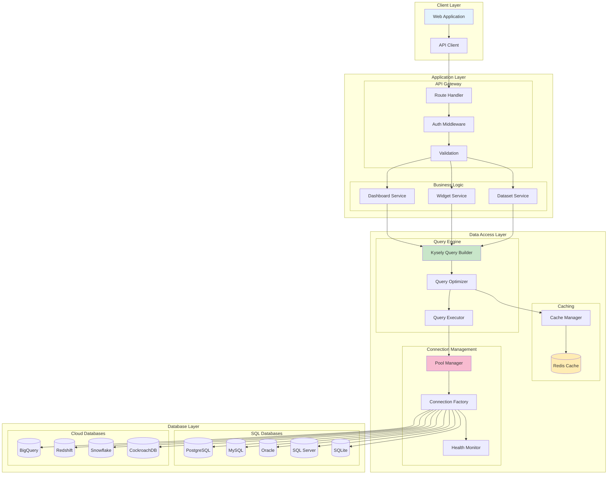
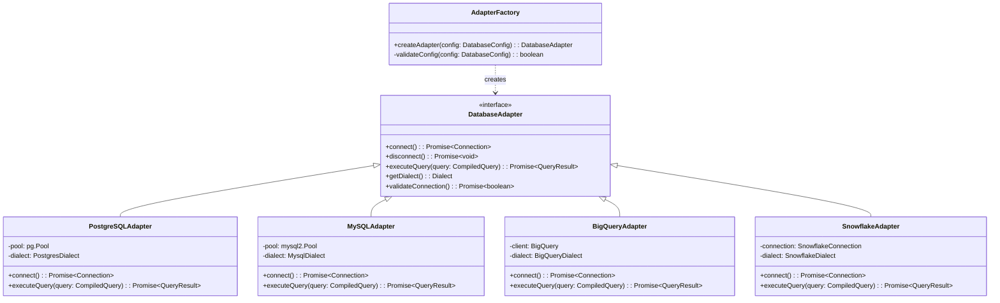
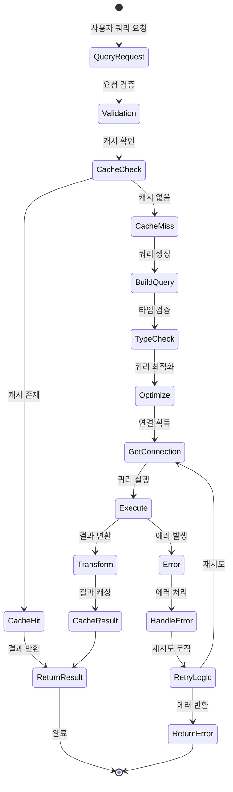

# VanillaMeta SQL 아키텍처 TOBE 상세 설계

## TOBE 아키텍처 다이어그램

### 전체 시스템 아키텍처



### 데이터베이스 어댑터 아키텍처



### 쿼리 처리 흐름



## SVG 아키텍처 다이어그램

### 계층형 아키텍처 SVG

```svg
<svg width="800" height="600" xmlns="http://www.w3.org/2000/svg">
  <!-- Background -->
  <rect width="800" height="600" fill="#f5f5f5"/>
  
  <!-- Title -->
  <text x="400" y="30" text-anchor="middle" font-size="24" font-weight="bold">VanillaMeta TOBE Architecture</text>
  
  <!-- Client Layer -->
  <g id="client-layer">
    <rect x="50" y="60" width="700" height="80" fill="#e3f2fd" stroke="#1976d2" stroke-width="2" rx="5"/>
    <text x="400" y="85" text-anchor="middle" font-size="16" font-weight="bold">Client Layer</text>
    <rect x="200" y="95" width="150" height="30" fill="#bbdefb" stroke="#1565c0" rx="3"/>
    <text x="275" y="115" text-anchor="middle" font-size="14">React UI</text>
    <rect x="450" y="95" width="150" height="30" fill="#bbdefb" stroke="#1565c0" rx="3"/>
    <text x="525" y="115" text-anchor="middle" font-size="14">Query Builder</text>
  </g>
  
  <!-- API Layer -->
  <g id="api-layer">
    <rect x="50" y="160" width="700" height="100" fill="#fff3e0" stroke="#f57c00" stroke-width="2" rx="5"/>
    <text x="400" y="185" text-anchor="middle" font-size="16" font-weight="bold">API Layer (NestJS)</text>
    <rect x="150" y="200" width="120" height="40" fill="#ffe0b2" stroke="#ef6c00" rx="3"/>
    <text x="210" y="225" text-anchor="middle" font-size="12">Auth Service</text>
    <rect x="290" y="200" width="120" height="40" fill="#ffe0b2" stroke="#ef6c00" rx="3"/>
    <text x="350" y="225" text-anchor="middle" font-size="12">Dataset Service</text>
    <rect x="430" y="200" width="120" height="40" fill="#ffe0b2" stroke="#ef6c00" rx="3"/>
    <text x="490" y="225" text-anchor="middle" font-size="12">Widget Service</text>
    <rect x="570" y="200" width="120" height="40" fill="#ffe0b2" stroke="#ef6c00" rx="3"/>
    <text x="630" y="225" text-anchor="middle" font-size="12">Dashboard Service</text>
  </g>
  
  <!-- Query Engine Layer -->
  <g id="query-layer">
    <rect x="50" y="280" width="700" height="120" fill="#f3e5f5" stroke="#7b1fa2" stroke-width="2" rx="5"/>
    <text x="400" y="305" text-anchor="middle" font-size="16" font-weight="bold">Query Engine Layer</text>
    <rect x="100" y="320" width="140" height="60" fill="#e1bee7" stroke="#6a1b9a" rx="3"/>
    <text x="170" y="345" text-anchor="middle" font-size="12">Kysely</text>
    <text x="170" y="365" text-anchor="middle" font-size="12">Query Builder</text>
    <rect x="260" y="320" width="140" height="60" fill="#e1bee7" stroke="#6a1b9a" rx="3"/>
    <text x="330" y="345" text-anchor="middle" font-size="12">Query</text>
    <text x="330" y="365" text-anchor="middle" font-size="12">Optimizer</text>
    <rect x="420" y="320" width="140" height="60" fill="#ffecb3" stroke="#ffa000" rx="3"/>
    <text x="490" y="345" text-anchor="middle" font-size="12">Redis</text>
    <text x="490" y="365" text-anchor="middle" font-size="12">Cache</text>
    <rect x="580" y="320" width="140" height="60" fill="#e1bee7" stroke="#6a1b9a" rx="3"/>
    <text x="650" y="345" text-anchor="middle" font-size="12">Connection</text>
    <text x="650" y="365" text-anchor="middle" font-size="12">Pool</text>
  </g>
  
  <!-- Database Layer -->
  <g id="db-layer">
    <rect x="50" y="420" width="700" height="120" fill="#e8f5e9" stroke="#388e3c" stroke-width="2" rx="5"/>
    <text x="400" y="445" text-anchor="middle" font-size="16" font-weight="bold">Database Layer</text>
    <!-- Traditional DBs -->
    <rect x="80" y="460" width="80" height="60" fill="#c8e6c9" stroke="#2e7d32" rx="3"/>
    <text x="120" y="485" text-anchor="middle" font-size="11">PostgreSQL</text>
    <rect x="170" y="460" width="80" height="60" fill="#c8e6c9" stroke="#2e7d32" rx="3"/>
    <text x="210" y="485" text-anchor="middle" font-size="11">MySQL</text>
    <rect x="260" y="460" width="80" height="60" fill="#c8e6c9" stroke="#2e7d32" rx="3"/>
    <text x="300" y="485" text-anchor="middle" font-size="11">Oracle</text>
    <rect x="350" y="460" width="80" height="60" fill="#c8e6c9" stroke="#2e7d32" rx="3"/>
    <text x="390" y="485" text-anchor="middle" font-size="11">SQL Server</text>
    <!-- Cloud DBs -->
    <rect x="460" y="460" width="80" height="60" fill="#a5d6a7" stroke="#1b5e20" rx="3"/>
    <text x="500" y="485" text-anchor="middle" font-size="11">BigQuery</text>
    <rect x="550" y="460" width="80" height="60" fill="#a5d6a7" stroke="#1b5e20" rx="3"/>
    <text x="590" y="485" text-anchor="middle" font-size="11">Snowflake</text>
    <rect x="640" y="460" width="80" height="60" fill="#a5d6a7" stroke="#1b5e20" rx="3"/>
    <text x="680" y="485" text-anchor="middle" font-size="11">Redshift</text>
  </g>
  
  <!-- Arrows -->
  <g id="arrows">
    <!-- Client to API -->
    <line x1="400" y1="140" x2="400" y2="160" stroke="#666" stroke-width="2" marker-end="url(#arrowhead)"/>
    <!-- API to Query -->
    <line x1="400" y1="260" x2="400" y2="280" stroke="#666" stroke-width="2" marker-end="url(#arrowhead)"/>
    <!-- Query to DB -->
    <line x1="400" y1="400" x2="400" y2="420" stroke="#666" stroke-width="2" marker-end="url(#arrowhead)"/>
  </g>
  
  <!-- Arrow marker definition -->
  <defs>
    <marker id="arrowhead" markerWidth="10" markerHeight="10" refX="9" refY="3" orient="auto">
      <polygon points="0 0, 10 3, 0 6" fill="#666"/>
    </marker>
  </defs>
</svg>
```

### 데이터 흐름 SVG

```svg
<svg width="900" height="400" xmlns="http://www.w3.org/2000/svg">
  <!-- Background -->
  <rect width="900" height="400" fill="#fafafa"/>
  
  <!-- Title -->
  <text x="450" y="30" text-anchor="middle" font-size="20" font-weight="bold">Query Processing Flow</text>
  
  <!-- Process Boxes -->
  <g id="processes">
    <!-- 1. Request -->
    <rect x="20" y="80" width="120" height="60" fill="#e3f2fd" stroke="#1976d2" stroke-width="2" rx="5"/>
    <text x="80" y="105" text-anchor="middle" font-size="12" font-weight="bold">Query Request</text>
    <text x="80" y="125" text-anchor="middle" font-size="10">From Client</text>
    
    <!-- 2. Validation -->
    <rect x="170" y="80" width="120" height="60" fill="#fff3e0" stroke="#f57c00" stroke-width="2" rx="5"/>
    <text x="230" y="105" text-anchor="middle" font-size="12" font-weight="bold">Validation</text>
    <text x="230" y="125" text-anchor="middle" font-size="10">Type Check</text>
    
    <!-- 3. Cache Check -->
    <rect x="320" y="80" width="120" height="60" fill="#ffecb3" stroke="#ffa000" stroke-width="2" rx="5"/>
    <text x="380" y="105" text-anchor="middle" font-size="12" font-weight="bold">Cache Check</text>
    <text x="380" y="125" text-anchor="middle" font-size="10">Redis</text>
    
    <!-- Cache Hit Path -->
    <rect x="320" y="200" width="120" height="60" fill="#c8e6c9" stroke="#388e3c" stroke-width="2" rx="5"/>
    <text x="380" y="225" text-anchor="middle" font-size="12" font-weight="bold">Cache Hit</text>
    <text x="380" y="245" text-anchor="middle" font-size="10">Return Cached</text>
    
    <!-- 4. Query Building -->
    <rect x="470" y="80" width="120" height="60" fill="#f3e5f5" stroke="#7b1fa2" stroke-width="2" rx="5"/>
    <text x="530" y="105" text-anchor="middle" font-size="12" font-weight="bold">Build Query</text>
    <text x="530" y="125" text-anchor="middle" font-size="10">Kysely</text>
    
    <!-- 5. Optimization -->
    <rect x="620" y="80" width="120" height="60" fill="#f3e5f5" stroke="#7b1fa2" stroke-width="2" rx="5"/>
    <text x="680" y="105" text-anchor="middle" font-size="12" font-weight="bold">Optimize</text>
    <text x="680" y="125" text-anchor="middle" font-size="10">Query Plan</text>
    
    <!-- 6. Execution -->
    <rect x="770" y="80" width="120" height="60" fill="#e8f5e9" stroke="#388e3c" stroke-width="2" rx="5"/>
    <text x="830" y="105" text-anchor="middle" font-size="12" font-weight="bold">Execute</text>
    <text x="830" y="125" text-anchor="middle" font-size="10">Database</text>
    
    <!-- 7. Transform -->
    <rect x="620" y="200" width="120" height="60" fill="#f3e5f5" stroke="#7b1fa2" stroke-width="2" rx="5"/>
    <text x="680" y="225" text-anchor="middle" font-size="12" font-weight="bold">Transform</text>
    <text x="680" y="245" text-anchor="middle" font-size="10">Type Safe</text>
    
    <!-- 8. Cache Store -->
    <rect x="470" y="200" width="120" height="60" fill="#ffecb3" stroke="#ffa000" stroke-width="2" rx="5"/>
    <text x="530" y="225" text-anchor="middle" font-size="12" font-weight="bold">Cache Store</text>
    <text x="530" y="245" text-anchor="middle" font-size="10">TTL Based</text>
    
    <!-- 9. Response -->
    <rect x="170" y="200" width="120" height="60" fill="#e3f2fd" stroke="#1976d2" stroke-width="2" rx="5"/>
    <text x="230" y="225" text-anchor="middle" font-size="12" font-weight="bold">Response</text>
    <text x="230" y="245" text-anchor="middle" font-size="10">To Client</text>
  </g>
  
  <!-- Flow Arrows -->
  <g id="flow-arrows">
    <!-- Main Flow -->
    <path d="M 140 110 L 170 110" stroke="#333" stroke-width="2" fill="none" marker-end="url(#arrow)"/>
    <path d="M 290 110 L 320 110" stroke="#333" stroke-width="2" fill="none" marker-end="url(#arrow)"/>
    <path d="M 440 110 L 470 110" stroke="#333" stroke-width="2" fill="none" marker-end="url(#arrow)"/>
    <path d="M 590 110 L 620 110" stroke="#333" stroke-width="2" fill="none" marker-end="url(#arrow)"/>
    <path d="M 740 110 L 770 110" stroke="#333" stroke-width="2" fill="none" marker-end="url(#arrow)"/>
    
    <!-- Cache Hit -->
    <path d="M 380 140 L 380 200" stroke="#4caf50" stroke-width="2" fill="none" marker-end="url(#arrow-green)"/>
    <path d="M 320 230 L 290 230" stroke="#4caf50" stroke-width="2" fill="none" marker-end="url(#arrow-green)"/>
    
    <!-- Cache Miss -->
    <text x="450" y="100" font-size="10" fill="#666">miss</text>
    
    <!-- Return Flow -->
    <path d="M 830 140 L 830 170 Q 830 190 810 190 L 740 190 Q 720 190 720 210 L 720 200" 
          stroke="#333" stroke-width="2" fill="none" marker-end="url(#arrow)"/>
    <path d="M 620 230 L 590 230" stroke="#333" stroke-width="2" fill="none" marker-end="url(#arrow)"/>
    <path d="M 470 230 L 440 230" stroke="#333" stroke-width="2" fill="none" marker-end="url(#arrow)"/>
  </g>
  
  <!-- Performance Metrics -->
  <g id="metrics">
    <rect x="50" y="320" width="800" height="60" fill="#f5f5f5" stroke="#999" stroke-width="1" rx="3"/>
    <text x="60" y="340" font-size="12" font-weight="bold">Performance Targets:</text>
    <text x="60" y="360" font-size="11">• Cache Hit Rate: >80%</text>
    <text x="250" y="360" font-size="11">• Avg Query Time: <100ms</text>
    <text x="450" y="360" font-size="11">• Connection Pool Efficiency: >90%</text>
    <text x="680" y="360" font-size="11">• Error Rate: <0.1%</text>
  </g>
  
  <!-- Arrow markers -->
  <defs>
    <marker id="arrow" markerWidth="10" markerHeight="10" refX="9" refY="3" orient="auto">
      <polygon points="0 0, 10 3, 0 6" fill="#333"/>
    </marker>
    <marker id="arrow-green" markerWidth="10" markerHeight="10" refX="9" refY="3" orient="auto">
      <polygon points="0 0, 10 3, 0 6" fill="#4caf50"/>
    </marker>
  </defs>
</svg>
```

## 핵심 인터페이스 정의

### 1. Database Configuration

```typescript
interface DatabaseConfig {
  id: number
  name: string
  type: DatabaseType
  connectionConfig: ConnectionConfig
  poolConfig?: PoolConfig
  cacheConfig?: CacheConfig
}

interface ConnectionConfig {
  host?: string
  port?: number
  database?: string
  user?: string
  password?: string
  // Cloud-specific configs
  projectId?: string      // BigQuery
  warehouse?: string      // Snowflake
  cluster?: string        // Redshift
  connectionString?: string // Generic
}

interface PoolConfig {
  min: number
  max: number
  idleTimeoutMillis?: number
  connectionTimeoutMillis?: number
  maxUses?: number
}

interface CacheConfig {
  enabled: boolean
  ttl: number // seconds
  maxSize: number // MB
  strategy: 'LRU' | 'LFU' | 'FIFO'
}
```

### 2. Query Builder Interface

```typescript
interface QueryBuilderService<DB> {
  // Raw SQL Execution - BI 도구 핵심 기능
  executeRawSQL<T = any>(config: RawSQLConfig): Promise<QueryResult<T>>
  executeDatasetQuery<T = any>(config: DatasetQueryConfig): Promise<QueryResult<T>>
  
  // Basic operations
  select<T>(): SelectQueryBuilder<DB, T>
  insert<T>(table: TableName): InsertQueryBuilder<DB, T>
  update<T>(table: TableName): UpdateQueryBuilder<DB, T>
  delete(table: TableName): DeleteQueryBuilder<DB>
  
  // Advanced operations
  with<T>(name: string, query: CompiledQuery<T>): WithQueryBuilder<DB>
  raw<T>(sql: string, params?: any[]): RawQueryBuilder<T>
  
  // Execution
  execute<T>(query: CompiledQuery<T>): Promise<QueryResult<T>>
  transaction<T>(fn: TransactionFn<T>): Promise<T>
}

interface RawSQLConfig {
  databaseId: number
  query: string              // 사용자가 SQL 에디터에서 작성한 쿼리
  parameters?: any[]         // 파라미터 바인딩용 값
  cacheTTL?: number         // 캐시 TTL (초)
  streaming?: boolean       // 대용량 결과 스트리밍 여부
  timeout?: number          // 쿼리 타임아웃 (ms)
}

interface DatasetQueryConfig {
  datasetId: number         // 저장된 데이터셋 ID
  parameters?: any[]        // 동적 파라미터
  cacheTTL?: number         // 캐시 TTL (초)
}

interface QueryResult<T> {
  rows: T[]
  fields: FieldInfo[]
  rowCount: number
  executionTime: number
  cached: boolean
}

interface FieldInfo {
  name: string
  dataType: DataType
  nullable: boolean
  maxLength?: number
  precision?: number
  scale?: number
}
```

### 3. Cache Service Interface

```typescript
interface CacheService {
  // Basic operations
  get<T>(key: string): Promise<T | null>
  set<T>(key: string, value: T, options?: CacheOptions): Promise<void>
  delete(key: string): Promise<boolean>
  exists(key: string): Promise<boolean>
  
  // Batch operations
  mget<T>(keys: string[]): Promise<(T | null)[]>
  mset<T>(entries: CacheEntry<T>[]): Promise<void>
  
  // Pattern operations
  keys(pattern: string): Promise<string[]>
  deletePattern(pattern: string): Promise<number>
  
  // Management
  clear(): Promise<void>
  size(): Promise<number>
  info(): Promise<CacheInfo>
}

interface CacheOptions {
  ttl?: number
  tags?: string[]
  compress?: boolean
}

interface CacheEntry<T> {
  key: string
  value: T
  options?: CacheOptions
}

interface CacheInfo {
  hits: number
  misses: number
  hitRate: number
  size: number
  keys: number
}
```

### 4. Connection Manager Interface

```typescript
interface ConnectionManager {
  // Connection lifecycle
  createConnection(config: DatabaseConfig): Promise<DatabaseConnection>
  getConnection(id: number): Promise<DatabaseConnection>
  releaseConnection(id: number): Promise<void>
  destroyConnection(id: number): Promise<void>
  
  // Pool management
  getPoolStats(id: number): PoolStats
  resizePool(id: number, size: number): Promise<void>
  drainPool(id: number): Promise<void>
  
  // Health monitoring
  healthCheck(id: number): Promise<HealthStatus>
  validateConnection(id: number): Promise<boolean>
  ping(id: number): Promise<number> // latency in ms
}

interface DatabaseConnection {
  id: number
  db: Kysely<any>
  adapter: DatabaseAdapter
  createdAt: Date
  lastUsedAt: Date
  useCount: number
}

interface PoolStats {
  size: number
  active: number
  idle: number
  waiting: number
  maxSize: number
  created: number
  destroyed: number
}

interface HealthStatus {
  status: 'healthy' | 'degraded' | 'unhealthy'
  latency: number
  lastCheck: Date
  errors: string[]
}
```

## 구현 우선순위

1. **Phase 1**: Core Infrastructure (Week 1-2)
   - Kysely 통합
   - 기본 어댑터 구현 (PostgreSQL, MySQL)
   - Connection Manager

2. **Phase 2**: Query Processing (Week 3-4)
   - Query Builder Service
   - Type-safe query generation
   - Query optimization

3. **Phase 3**: Caching Layer (Week 5)
   - Redis integration
   - Cache service implementation
   - Cache invalidation strategy

4. **Phase 4**: Advanced Features (Week 6-7)
   - Additional database adapters
   - Performance monitoring
   - Query analytics

5. **Phase 5**: Migration & Testing (Week 8-9)
   - Service migration
   - Integration testing
   - Performance benchmarking

## 성능 목표

- **쿼리 응답 시간**: < 100ms (95th percentile)
- **캐시 히트율**: > 80%
- **동시 연결 수**: 1000+
- **메모리 사용량**: 현재 대비 50% 감소
- **에러율**: < 0.1%